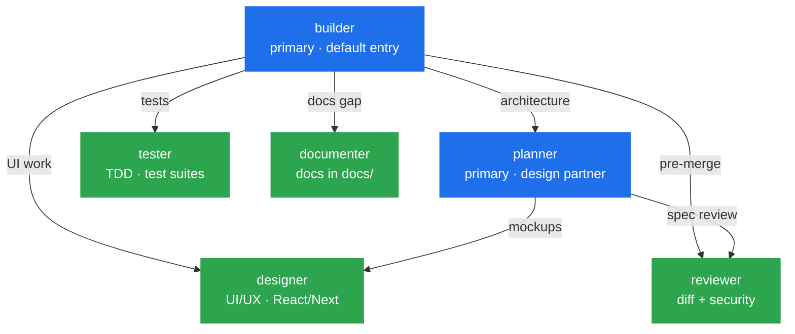

<div align="center">


# oh-my-openkilo

**A team of AI specialists for OpenCode. You describe the task, they do the work.**

This pack gives OpenCode 6 specialist agents, 47 how-to guides, and 3 house rules. It works with free models, so there is nothing to pay and no API key to set up.

<sub>by <b>PanPanFR</b> · OpenCode adaptation of Kilo Code's team workflow</sub>

<p>
  <a href="LICENSE"></a>
  <a href="https://github.com/PanPanFR/oh-my-openkilo/releases/latest"></a>
  <a href="https://github.com/PanPanFR/oh-my-openkilo/stargazers"></a>
  <a href="https://github.com/PanPanFR/oh-my-openkilo/commits/main"></a>
  <br>
  <a href="#-meet-the-team"></a>
  <a href="#-skills"></a>
  <a href="SECURITY.md"></a>
  
  
</p>

<sub>✦ ✦ ✦</sub>

</div>

---

## 🚀 Start here (3 steps, no terminal needed)

**Step 1.** Open OpenCode and paste this. The AI installs everything for you:

> **"Install the oh-my-openkilo config pack for OpenCode: clone https://github.com/PanPanFR/oh-my-openkilo into `~/.config/opencode/oh-my-openkilo`, copy its `agents/`, `skills/`, `rules/`, `commands/`, `plugins/` folders and `AGENTS.md` into `~/.config/opencode/`, then run `/configcheck` and tell me what's missing."**

The agent shows each command before running it, so nothing happens in the dark. Your existing settings, API keys, and extras are never touched.

**Step 2.** Still by prompting, install the two helper tools (a code map and a memory server), then start the memory server:

> **"Install the required dependencies for this pack: the graphify knowledge graph CLI and the agentmemory server + MCP, then start the memory server."**

**Step 3.** Restart OpenCode (or run `/reload`), then give it a real task:

> **"Audit this repository's architecture and identify the biggest problems."**

That is the whole setup. Future updates are just `/update-pack` inside OpenCode.

> [!TIP]
> Prefer doing it yourself in a terminal? The exact commands for Windows, macOS, and Linux are in [Installation](#-installation).
> To install a specific release instead of the latest, tell the agent to replace `main` with a tag (e.g. `v0.8.4`), or check the [latest release](https://github.com/PanPanFR/oh-my-openkilo/releases/latest).

---

## 📦 What is this?

OpenCode on its own is one general assistant. This pack turns it into a small team:

- **Specialists for each job.** A builder that does the coding, a planner that thinks before anyone codes, plus experts for UI, tests, code review, and docs. You talk to the builder; the builder calls in the experts when needed.
- **How-to guides for common tasks.** 47 short playbooks (debugging, testing, code review, planning, and more). The right guide loads automatically when your task matches it. You never open them yourself.
- **Memory + a map of your code.** The pack remembers what happened in past sessions and keeps a searchable map of your codebase, so answers are based on your actual code, not guesses.

Technically it is just files: plain-text prompts plus a few tiny plugins. There is nothing to compile and no installer to run. It works on Windows (tested) and on macOS/Linux (same steps, not tested by the maintainer, see [Compatibility](#-compatibility)).

The workflow ideas come from [Kilo Code](https://github.com/Kilo-Org/kilocode), and the file-sharing style from **[oh-my-opencode-slim](https://github.com/alvinunreal/oh-my-opencode-slim)**.

---

## 🧰 What do you get?

| Piece | Count | Plain meaning |
|-----------|-------|--------------|
| Agents    | 6     | The team members (see below). |
| Skills    | 47    | How-to guides the agents follow automatically. Full list: [docs/SKILLS.md](docs/SKILLS.md). |
| Rules     | 3     | House rules applied to every session (check memory, write in English, keep replies short). Details: [docs/RULES.md](docs/RULES.md). |
| Plugins   | 7     | Small extras (auto-save notes, code map sync, short-reply mode, token-saving shell output). All optional, remove any to disable. |
| Commands  | 12    | Shortcuts like `/update-pack` and `/recall`. All optional. List: [docs/COMMANDS.md](docs/COMMANDS.md). |



---

## 🏛️ Meet the team

You only ever talk to **two** of them. The rest work behind the scenes.

**Talk to these directly:**

- **`builder`** 🏗️, the default. Give it any coding task. It either does it or calls in the right expert.
- **`planner`** 🔮, the thinker. Use it before big work: *"Plan a rate-limiter for our API. Don't write code yet, show me the options first."* It writes a plan for you to approve, and nothing gets built until you say so.

**These join automatically when needed:**

- **`designer`** 🎨, user interfaces and web design.
- **`tester`** 🧪, writes and runs tests.
- **`reviewer`** 🛡️, checks finished work for bugs and security holes. Never changes code.
- **`documenter`** 📚, writes docs that match what the code actually does.

Each agent is one text file in `agents/`. To change how one behaves, edit its file. To change its AI model, edit the `model:` line at the top, then restart OpenCode. The same header also carries `variant:` (how hard the model thinks), shipped tuned per role: the builder and planner think at full depth, while the faster, cheaper jobs (tests, docs, UI) dial it down so they answer sooner. Full guide: [docs/AGENTS.md](docs/AGENTS.md).

> [!NOTE]
> This pack replaces OpenCode's built-in `build` and `plan` agents with its own `builder` and `planner` to avoid having two agents for the same job.

---

## 🎯 Three things to try first

**1. Get a plan before building** (uses `planner`):

> "Plan a rate-limiter for our API. Don't write code yet, show me the options first."

Result: a written plan per workstream with concrete steps. Nothing is built until you approve.

**2. Audit a repository** (uses `builder` + `reviewer`):

> "Audit this repository's architecture and identify the biggest problems."

Result: a structured report based on your actual code.

**3. Debug something** (uses `builder`):

> "This test passes locally but fails in CI. Find the root cause and fix it."

Result: diagnosis with evidence first, fix second, plus a regression test.

Three more examples (new feature, architecture review, exploring a codebase) live in [docs/WORKFLOWS.md](docs/WORKFLOWS.md).

---

## 💸 Free to start

Every agent uses a **free OpenCode model** (`opencode/muse-spark-1.3-contributor-free`). No API key, no payment, no setup.

Want a stronger (paid) model later? Edit the `model:` line in the agent's file, then restart OpenCode. Which agent deserves the upgrade first, and the full model table, are in [docs/AGENTS.md](docs/AGENTS.md#how-to-change-a-model).

---

## ⚙️ Installation

**Recommended: let the agent do it.** Paste the [3-step prompt](#-start-here-3-steps-no-terminal-needed) into OpenCode and watch.

**Manual: run the commands yourself.**

<details>
<summary>Windows (PowerShell)</summary>

```powershell
git clone https://github.com/PanPanFR/oh-my-openkilo.git "$env:USERPROFILE\.config\opencode\oh-my-openkilo"
Copy-Item -Recurse -Force "$env:USERPROFILE\.config\opencode\oh-my-openkilo\agents"   "$env:USERPROFILE\.config\opencode\agents"
Copy-Item -Recurse -Force "$env:USERPROFILE\.config\opencode\oh-my-openkilo\skills"   "$env:USERPROFILE\.config\opencode\skills"
Copy-Item -Recurse -Force "$env:USERPROFILE\.config\opencode\oh-my-openkilo\rules"    "$env:USERPROFILE\.config\opencode\rules"
Copy-Item -Recurse -Force "$env:USERPROFILE\.config\opencode\oh-my-openkilo\commands" "$env:USERPROFILE\.config\opencode\commands"
Copy-Item -Recurse -Force "$env:USERPROFILE\.config\opencode\oh-my-openkilo\plugins"  "$env:USERPROFILE\.config\opencode\plugins"
Copy-Item -Force "$env:USERPROFILE\.config\opencode\oh-my-openkilo\AGENTS.md"        "$env:USERPROFILE\.config\opencode\AGENTS.md"
if (-not (Test-Path "$env:USERPROFILE\.config\opencode\opencode.json")) {
    Copy-Item -Force "$env:USERPROFILE\.config\opencode\oh-my-openkilo\examples\opencode.example.json" "$env:USERPROFILE\.config\opencode\opencode.json"
}
```

</details>

<details>
<summary>macOS / Linux</summary>

```bash
git clone https://github.com/PanPanFR/oh-my-openkilo.git ~/.config/opencode/oh-my-openkilo
for d in agents skills rules commands plugins; do
    cp -r ~/.config/opencode/oh-my-openkilo/$d ~/.config/opencode/$d
done
cp ~/.config/opencode/oh-my-openkilo/AGENTS.md ~/.config/opencode/AGENTS.md
[ -f ~/.config/opencode/opencode.json ] || cp ~/.config/opencode/oh-my-openkilo/examples/opencode.example.json ~/.config/opencode/opencode.json
```

</details>

<details>
<summary>Helper tools both paths need (code map + memory)</summary>

```bash
# 1. Code map (Python, note the package name has a double y: graphifyy)
uv tool install graphifyy            # or: pipx install graphifyy, or: pip install graphifyy
# 1b. Code map (Node, older path, only if you already have it)
npm i -g graphify

# 2. Memory that survives between sessions
npm i -g @agentmemory/server
npm i -g @agentmemory/mcp            # the piece OpenCode talks to

# 3. Start the memory server (once, leave it running)
agentmemory serve
```

**Use a local install for the memory piece, not `npx`.** Point `mcp.agentmemory.command` in `opencode.json` at the installed file path. `npx` re-downloads on every start and breaks without internet. `/configcheck` warns you if the `npx` form is present; the full recipe is in [docs/INSTALL.md](docs/INSTALL.md).

</details>

### After install

1. Nothing to edit for free models. Only if you want a paid model: set it in `~/.config/opencode/opencode.json` (the example file uses `{env:VAR}` placeholders for keys).
2. **Restart OpenCode** or run `/reload`.
3. **Verify:** run `/configcheck`. It reports what works and what is missing.

> [!IMPORTANT]
> Installing overwrites `agents/`, `skills/`, `rules/`, `commands/`, `plugins/`, and `AGENTS.md` in your config folder. Your `opencode.json`, models, keys, and extras are NOT touched. Keeping local edits? See [docs/INSTALL.md](docs/INSTALL.md).

> [!TIP]
> The full step-by-step guide, uninstall, and troubleshooting live in [docs/INSTALL.md](docs/INSTALL.md). Every setting is explained in [docs/CONFIGURATION.md](docs/CONFIGURATION.md).

---

## 🥊 Why so small?

The whole pack is 19 MB, mostly one helper binary. A comparable pack is 58.5 MB. Why? This pack ships text files, not a compiled program: no build step, installs in seconds, updates with `git pull`. If something breaks, it is a typo in a text file, not a failed build.

---

## 🆚 How it compares

### This pack vs oh-my-opencode-slim

Both give OpenCode a team of agents. Different philosophy:

| | oh-my-openkilo (this pack) | oh-my-opencode-slim |
|---|---|---|
| What it is | Plain text files (agents, skills, rules, commands) | Compiled TypeScript plugin (`dist/` bundle) |
| Install | `git clone` + copy files, seconds | Installer + build step (`bun install`, `bun run build`) |
| Models out of the box | Free (`opencode/*` defaults, zero credentials) | Paid presets by default (OpenAI; free preset exists) |
| Team | 6 agents: you talk to builder/planner, they fan out to 4 specialists | 7 agents under one orchestrator, background dispatch |
| Memory | Built-in: `recall`/`remember` across sessions via agentmemory | Workflow skills (deepwork, codemap, reflect) |
| Replies | Caveman terse mode (~65% fewer output tokens) | Standard replies + council multi-model answers |
| Update | `git pull` (or `/update-pack` in-session) | `git pull` + reinstall + rebuild |
| Debugging | Read the text file, fix the typo | Rebuild the bundle |

Pick this pack if you want free models, zero build, and files you can read and edit directly. Pick slim if you want background orchestration with tmux panes, council answers, and paid-model presets.

### With this pack vs plain OpenCode

| Plain OpenCode | With this pack |
|---|---|
| One model does everything: plan, code, test, review, docs | Each job goes to the right agent (planner designs, tester tests, reviewer reviews) |
| Every session starts from zero | `recall` finds past decisions, `remember` saves new ones |
| Full-length replies every turn | Caveman mode: short replies, same meaning |
| Broad reads to understand code | Graphify: scoped subgraph first, then read |
| Verbose shell output eats context | RTK rewrites commands to compact form (~half the bytes) |
| No plan discipline | Planner writes a self-contained plan you approve before code |
| Reviews and tests when you remember | Built-in reviewer (security + spec) and tester (isolated loops) |

---

## ⌨️ Commands you will actually use

You can ignore this section at first. Plain sentences work too ("update this pack", "what did we do about X last week").

- **`/update-pack`** keeps the pack fresh from GitHub. The one you will use, rarely.
- **`/recall <query>`** searches past work ("what did we decide about auth?"). **`/remember <note>`** saves a note for later.
- **`/configcheck`** verifies the install after setup.

The rest (`/caveman` subcommands for short replies, `/impeccable` for UI review, `/integrate` for merging parallel work) are covered in [docs/COMMANDS.md](docs/COMMANDS.md) when you need them.

---

## 🔄 Updating the pack

In an OpenCode session, run `/update-pack`, or say:

> **"Update the oh-my-openkilo pack: pull the latest from https://github.com/PanPanFR/oh-my-openkilo and sync it into my config, backing up any file you overwrite."**

Then restart OpenCode or run `/reload`. Changed files are backed up automatically, so your edits are never lost silently. Terminal-only alternative and recovery steps: [docs/COMMANDS.md](docs/COMMANDS.md#update-pack-in-detail).

---

## 🧩 Skills

47 how-to guides in 5 groups. They load on their own when your task matches; you never open them.

| Group | Count | Examples |
|----------|-------|----------|
| core | 19 | `clean-code`, `cloudflare`, `code-review`, `impeccable`, `plans`, `systematic-debugging`, `test-driven-development`, `web-perf` |
| agentmemory | 6 | `agentmemory-architecture`, `agentmemory-config`, `agentmemory-mcp-tools`, `agentmemory-rest-api` |
| caveman | 6 | `caveman`, `caveman-commit`, `caveman-review` |
| workflow & memory | 14 | `commit-context`, `delegation`, `handoff`, `lesson`, `recall`, `remember`, `recap` |
| browser | 2 | `playwright-cli`, `graphify` |

> **All 47 with descriptions:** [docs/SKILLS.md](docs/SKILLS.md)

---

## 📏 Rules

Three house rules, active in every session:

| Rule | What it means |
|------|---------|
| `skill-reminder` | Before any task: check past notes, then load the matching how-to guide |
| `language` | Files are written in English; chat can be any language |
| `communication-style` | Replies stay short, code stays minimal |

> **Full rule guide:** [docs/RULES.md](docs/RULES.md)

---

## 📚 Documentation

Start with install, then jump to whatever you need:

| Doc | What it covers |
|-----|----------------|
| [docs/INSTALL.md](docs/INSTALL.md) | Step-by-step install, uninstall, troubleshooting |
| [docs/WORKFLOWS.md](docs/WORKFLOWS.md) | Full worked examples (audit, debug, new feature, arch review, code map) |
| [docs/AGENTS.md](docs/AGENTS.md) | All 6 agents: when to use each, how to edit, model table |
| [docs/SKILLS.md](docs/SKILLS.md) | All 47 guides grouped by category, with descriptions |
| [docs/COMMANDS.md](docs/COMMANDS.md) | Command reference, `/update-pack` mechanics |
| [docs/STRUCTURE.md](docs/STRUCTURE.md) | Every folder and file in the repo, explained |
| [docs/RULES.md](docs/RULES.md) | The 3 house rules in detail |
| [docs/CONFIGURATION.md](docs/CONFIGURATION.md) | Settings file explained block by block, keys, per-tool setup |

---

## 🖥️ Compatibility

| Platform / Tool | Status |
|-----------------|--------|
| OpenCode (CLI) | tested |
| Windows | tested |
| macOS | untested by maintainer |
| Linux | untested by maintainer |
| `graphify` | required (falls back to plain search if missing) |
| `agentmemory` | required (falls back to in-session memory only if missing) |

> [!NOTE]
> The maintainer develops and tests on Windows only. The install steps above work on macOS and Linux paths, but no full session has been run there. Hit a Unix-specific bug? Please [open an issue](https://github.com/PanPanFR/oh-my-openkilo/issues).

---

## 🙏 Credits

oh-my-openkilo is the OpenCode adaptation of **[oh-my-kilo](https://github.com/PanPanFR/oh-my-kilo)** (same maintainer). The structure and file-sharing style are inspired by **[oh-my-opencode-slim](https://github.com/alvinunreal/oh-my-opencode-slim)** by [alvinunreal](https://github.com/alvinunreal). The team workflow ideas (triage, delegation, guides as protocols, map-first navigation) come from **[Kilo Code](https://github.com/Kilo-Org/kilocode)**.

For a visual control room on top of OpenCode, **[OpenChamber](https://openchamber.dev/)** (VS Code Marketplace, [github.com/openchamber/openchamber](https://github.com/openchamber/openchamber)) composes naturally with this pack.

---

## 🔒 Security

The pack ships **zero credentials**, only `{env:VAR}` placeholders plus permission defaults you should review. See [SECURITY.md](SECURITY.md).

## Contributing

Found a bug, an install issue, or have an agent/guide suggestion? Open an issue or PR. See [CONTRIBUTING.md](CONTRIBUTING.md).

## License

MIT. See [LICENSE](LICENSE).
