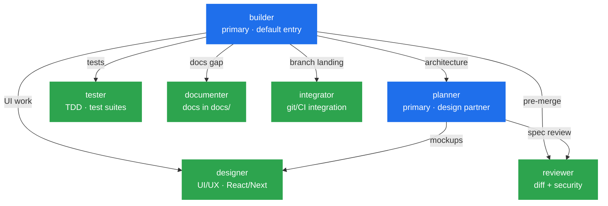

<div align="center">


# oh-my-openkilo

**Prompts in files. Models in config. Behavior in rules.**
A curated OpenCode prompt + plugin source pack: 7 agents, 46 skills, 3 rules, 6 plugins, 10 commands. ~18× lighter than comparable plugin packs. Zero credentials to start.

<sub>by <b>PanPanFR</b> · OpenCode adaptation of Kilo Code's agentic workflow</sub>

<p>
  <a href="LICENSE"></a>
  <a href="https://github.com/PanPanFR/oh-my-openkilo/releases/latest"></a>
  <a href="https://github.com/PanPanFR/oh-my-openkilo/stargazers"></a>
  <a href="https://github.com/PanPanFR/oh-my-openkilo/commits/main"></a>
  <br>
  <a href="#-meet-the-agents"></a>
  <a href="#-skills"></a>
  <a href="SECURITY.md"></a>
  
  
</p>

<sub>✦ ✦ ✦</sub>

</div>

---

## ✨ Highlights

- **[7 specialized agents](#-meet-the-agents)** — 2 primary (`builder`, `planner`) + 5 subagents with a delegation hierarchy already designed. `builder` routes to `planner` for complex work and fans out to specialists in parallel.
- **[46 curated skills](#-skills)** — battle-tested playbooks (TDD, systematic debugging, code review, plans, web-perf) across 10 categories. Skills are prompt-based: no runtime, no build step.
- **[3 always-on rules](#-rules)** — `skill-reminder` (skill + memory check before any task), `language` (English files), `communication-style` (Caveman terse + Ponytail minimal). Other behaviors ship as on-demand skills.
- **[6 plugins](#-plugins)** — `agentmemory-capture` (auto-save observations), `graphify` (graph sync), `caveman` (terse mode), `ponytail` (minimal code), `superpowers` (skill loader), `checkpoint`/`recall-first` (safety nets). All optional, all from existing tools.
- **[10 slash commands](#-commands)** — `/update-pack` to keep in sync, `/recall` `/remember` for memory, plus 6 `/caveman-*` utilities.
- **[Prompts + rules in files, plugins in source](#-what-do-you-get)** — 509 files / 3.3 MB. A comparable plugin pack is 507 files / 58.5 MB. ~18× smaller because the artifacts are markdown + a few tiny TS plugin files, not a built runtime with `node_modules` and `dist/`.
- **[Free by default](#-default-models-are-free)** — every agent ships with a free OpenCode model. No API key required to start.
- **[Kilo Code flow, OpenCode runtime](#-what-is-oh-my-openkilo)** — same triage-then-delegate mental model that runs in VS Code/JetBrains via Kilo Code, here against OpenCode.

---

## 🪄 TL;DR

```powershell
# Windows (PowerShell)
git clone https://github.com/PanPanFR/oh-my-openkilo.git "$env:USERPROFILE\.config\opencode\oh-my-openkilo"
Copy-Item -Recurse -Force "$env:USERPROFILE\.config\opencode\oh-my-openkilo\agents"   "$env:USERPROFILE\.config\opencode\agents"
Copy-Item -Recurse -Force "$env:USERPROFILE\.config\opencode\oh-my-openkilo\skills"   "$env:USERPROFILE\.config\opencode\skills"
Copy-Item -Recurse -Force "$env:USERPROFILE\.config\opencode\oh-my-openkilo\rules"    "$env:USERPROFILE\.config\opencode\rules"
Copy-Item -Recurse -Force "$env:USERPROFILE\.config\opencode\oh-my-openkilo\commands" "$env:USERPROFILE\.config\opencode\commands"
Copy-Item -Recurse -Force "$env:USERPROFILE\.config\opencode\oh-my-openkilo\plugins"  "$env:USERPROFILE\.config\opencode\plugins"
Copy-Item -Force "$env:USERPROFILE\.config\opencode\oh-my-openkilo\AGENTS.md"        "$env:USERPROFILE\.config\opencode\AGENTS.md"
if (-not (Test-Path "$env:USERPROFILE\.config\opencode\opencode.json")) {
    Copy-Item -Force "$env:USERPROFILE\.config\opencode\oh-my-openkilo\examples\opencode.example.json" "$env:USERPROFILE\.config\opencode\opencode.json"
}
```

```bash
# macOS / Linux
git clone https://github.com/PanPanFR/oh-my-openkilo.git ~/.config/opencode/oh-my-openkilo
for d in agents skills rules commands plugins; do
    cp -r ~/.config/opencode/oh-my-openkilo/$d ~/.config/opencode/$d
done
cp ~/.config/opencode/oh-my-openkilo/AGENTS.md ~/.config/opencode/AGENTS.md
[ -f ~/.config/opencode/opencode.json ] || cp ~/.config/opencode/oh-my-openkilo/examples/opencode.example.json ~/.config/opencode/opencode.json
```

Then install the two required tools, edit `opencode.json` to fill in your API key, and open OpenCode. Inside OpenCode, run `/configcheck` to verify and `/update-pack` to keep things fresh.

> [!IMPORTANT]
> **Install these BEFORE the first session**, or memory skills and the `/graphify` workflow will be unavailable. Both are required for the pack to deliver its full value.

```bash
# 1. Knowledge graph (Python — `graphifyy` is the PyPI package, double y)
uv tool install graphifyy            # or: pipx install graphifyy, or: pip install graphifyy
# 1b. Knowledge graph (Node — older path, if you already have it)
npm i -g graphify

# 2. Persistent cross-session memory
npm i -g @agentmemory/server
npm i -g @agentmemory/mcp            # the MCP server OpenCode talks to

# 3. Start the memory REST server (do this once, leave it running)
agentmemory serve
```

> [!TIP]
> **Pin the agentmemory MCP locally, not via `npx`.** Replace the `mcp.agentmemory.command` in `opencode.json` with the absolute path to the locally installed entry point. npx re-downloads on every cold start and silently breaks when npm registry is unreachable.
>
> - Windows: `["node", "C:\\Users\\<You>\\AppData\\Roaming\\npm\\node_modules\\@agentmemory\\mcp\\bin.mjs"]`
> - macOS: `["node", "/usr/local/lib/node_modules/@agentmemory/mcp/bin.mjs"]`
> - Linux: `["node", "/usr/lib/node_modules/@agentmemory/mcp/bin.mjs"]`
>
> Run `/configcheck` to verify everything is wired up; it'll flag the `npx` form for you.

You now have 7 agents, 46 skills, 3 rules, and `/update-pack` to keep everything fresh. **Zero credentials** to start; the pack ships with free OpenCode models.

> [!TIP]
> The `git clone` command above uses the latest `main` branch. To pin a specific release, replace `main` with a tag (e.g. `v0.6.0`) or check the [latest release](https://github.com/PanPanFR/oh-my-openkilo/releases/latest).

---

## 📦 What is oh-my-openkilo?

A **prompt + plugin source pack** for [OpenCode](https://opencode.ai): plain files plus an installer that copies them into `~/.config/opencode`. The pack ships 5 small TypeScript plugins (loaded directly by OpenCode at runtime, no `dist/` or `node_modules` inside the pack) and a curated set of markdown prompts and rules. No build step on install. Designed for Windows; macOS and Linux are supported via the Unix installer but **have not been tested by the maintainer** (see [Compatibility](#-compatibility)).

The pack inherits its workflow patterns from [Kilo Code](https://github.com/Kilo-Org/kilocode) (primary-agent triage, subagent delegation, skills as protocols, graphify-first navigation, caveman/ponytail style). Same mental model, different runtime.

> [!NOTE]
> The pack structure and "prompt + plugin source" sharing approach are inspired by **[oh-my-opencode-slim](https://github.com/alvinunreal/oh-my-opencode-slim)**. This pack adapts the philosophy (specialized agents + delegation + skills + rules + a few tiny plugins) without shipping `dist/`, `node_modules`, or a build step.

The idea is simple: **prompts in files, models in config, behavior in rules.** Edit an agent by editing its file. Switch models via `opencode.json`. Add your own agents, skills, or rules without touching anything else.

---

## 🥊 Why it's lightweight

```
Size on disk (lower is better)
─────────────────────────────────────────────────────────────
oh-my-openkilo         ████                                     3.3 MB
oh-my-opencode-slim    ████████████████████████████████████████  58.5 MB
─────────────────────────────────────────────────────────────
                       0 MB                                  60 MB
```

| Aspect | oh-my-openkilo (prompt + plugin source pack) | Typical plugin pack |
|--------|----------------------------------------------|---------------------|
| **What you install** | Markdown prompts + 5 small TS plugin files (<4 KB each) + shell scripts | TypeScript source, build output, npm deps |
| **Build step** | None. Files are the artifact. | `bun install && bun run build` |
| **Install time** | Seconds | Minutes (download deps, compile TS) |
| **Update mechanism** | `git pull` + per-file copy + backup | `git pull` + `bun install` + rebuild |
| **Runtime overhead** | OpenCode reads markdown + executes 5 small TS plugin files (no `node_modules` to load) | Plugin loader runs on every startup with full dep tree |
| **What can break** | A misformed frontmatter, a typo in a path, a stale plugin hook | A version mismatch, a build error, a missing dep |

The pack **curates** well-known tools (`graphify`, `agentmemory`, `caveman`, `ponytail`, `superpowers`) and ships 5 tiny plugins (`agentmemory-capture`, `graphify`, `caveman`, `checkpoint`, `recall-first`) as plain TS source rather than building a new runtime.

---

## 🧰 What do you get?

| Component | Count | What it does |
|-----------|-------|--------------|
| Agents    | 7     | 2 primary + 5 subagents. `builder` delegates UI to `designer`, tests to `tester`, review to `reviewer`, etc. |
| Skills    | 46    | Curated playbooks across 5 categories. See [docs/SKILLS.md](docs/SKILLS.md) for the full table. |
| Rules     | 3     | Always-on session guardrails, loaded via the `instructions` config. See [docs/RULES.md](docs/RULES.md). |
| Plugins   | 6     | `agentmemory-capture`, `graphify`, `caveman`, `checkpoint`, `recall-first`, plus npm `ponytail` + `superpowers`. All optional. |
| Commands  | 10    | `/update-pack`, `/recall`, `/remember`, plus 6 `/caveman-*` utilities. See [docs/COMMANDS.md](docs/COMMANDS.md). |



---

## ⚙️ Installation

There is no installer. The pack is a Git repo, and the in-session `/update-pack` command is self-contained (it clones from the canonical URL, runs `git` directly, and syncs the files itself). One source of truth, no scripts that can go stale.

### Windows (PowerShell)

```powershell
git clone https://github.com/PanPanFR/oh-my-openkilo.git "$env:USERPROFILE\.config\opencode\oh-my-openkilo"
Copy-Item -Recurse -Force "$env:USERPROFILE\.config\opencode\oh-my-openkilo\agents"   "$env:USERPROFILE\.config\opencode\agents"
Copy-Item -Recurse -Force "$env:USERPROFILE\.config\opencode\oh-my-openkilo\skills"   "$env:USERPROFILE\.config\opencode\skills"
Copy-Item -Recurse -Force "$env:USERPROFILE\.config\opencode\oh-my-openkilo\rules"    "$env:USERPROFILE\.config\opencode\rules"
Copy-Item -Recurse -Force "$env:USERPROFILE\.config\opencode\oh-my-openkilo\commands" "$env:USERPROFILE\.config\opencode\commands"
Copy-Item -Recurse -Force "$env:USERPROFILE\.config\opencode\oh-my-openkilo\plugins"  "$env:USERPROFILE\.config\opencode\plugins"
Copy-Item -Force "$env:USERPROFILE\.config\opencode\oh-my-openkilo\AGENTS.md"        "$env:USERPROFILE\.config\opencode\AGENTS.md"
if (-not (Test-Path "$env:USERPROFILE\.config\opencode\opencode.json")) {
    Copy-Item -Force "$env:USERPROFILE\.config\opencode\oh-my-openkilo\examples\opencode.example.json" "$env:USERPROFILE\.config\opencode\opencode.json"
}
```

### macOS / Linux

```bash
git clone https://github.com/PanPanFR/oh-my-openkilo.git ~/.config/opencode/oh-my-openkilo
for d in agents skills rules commands plugins; do
    cp -r ~/.config/opencode/oh-my-openkilo/$d ~/.config/opencode/$d
done
cp ~/.config/opencode/oh-my-openkilo/AGENTS.md ~/.config/opencode/AGENTS.md
[ -f ~/.config/opencode/opencode.json ] || cp ~/.config/opencode/oh-my-openkilo/examples/opencode.example.json ~/.config/opencode/opencode.json
```

### After install

1. **Edit `~/.config/opencode/opencode.json`** to set your model and provider keys. The example uses `{env:VAR}` placeholders.
2. **Install required dependencies** (`graphify`, `agentmemory`). Without these the pack degrades severely. See [docs/INSTALL.md](docs/INSTALL.md#after-install-required-dependencies).
3. **Restart OpenCode** or run `/reload`.
4. **Verify:** inside OpenCode, run `/configcheck`. It will tell you what is wired up and what is missing.

> [!IMPORTANT]
> The install commands above overwrite any existing `agents/`, `skills/`, `rules/`, `commands/`, `plugins/`, and `AGENTS.md` under your config dir. Your `opencode.json`, model, provider, API keys, and MCP server entries are NOT touched. If you have local edits you want to keep, read [docs/INSTALL.md](docs/INSTALL.md) for the manual recipe.

> [!TIP]
> After install, future updates are just `/update-pack` inside OpenCode. No terminal, no script, no version URL to remember. The command reads its own source-of-truth URL.

> [!TIP]
> The full per-step install guide, uninstall, and troubleshooting live in [docs/INSTALL.md](docs/INSTALL.md). The example config is explained block-by-block in [docs/CONFIGURATION.md](docs/CONFIGURATION.md).

---

## 💸 Default models are free

Every agent defaults to a **free model provided by OpenCode** (e.g. `opencode/nemotron-3-ultra-free`, `opencode/muse-spark-1.2-contributor-free`). You can use the pack **without configuring any provider API key**.

Want a different model? Edit the `model:` line in the agent's markdown file (YAML frontmatter at the top), then restart OpenCode or run `/reload`. The full per-agent model table, mix-and-match recommendations, and edit workflow are in [docs/AGENTS.md](docs/AGENTS.md#how-to-change-a-model).

---

## 🔌 Required dependencies + MCPs

The pack **requires** two external tools to deliver its core value:

```bash
npm i -g graphify              # knowledge graph (the `graphify` skill depends on this)
npm i -g @agentmemory/server   # persistent cross-session memory (the memory skills depend on this)
```

| MCP | What it unlocks | Required? |
|-----|-----------------|-----------|
| `agentmemory` | Persistent cross-session memory | yes (required dependency) |
| `context7` | Up-to-date library docs | optional |
| `chrome-devtools` | Live browser debug | optional |
| `playwright` | E2E test gen, browser automation | optional |

Enable by setting `"enabled": true` in `opencode.json` and filling any required env var. Per-MCP install commands and credential handling are in [docs/CONFIGURATION.md](docs/CONFIGURATION.md#mcp-servers).

---

## 🎯 Example workflows

Two real prompts, showing what the pack actually does. Three more (new feature, architecture review, knowledge graph exploration) live in [docs/WORKFLOWS.md](docs/WORKFLOWS.md).

### 1. Repository audit

> "Audit this repository's architecture and identify the biggest problems."

- **Agent:** `builder` → gathers recon via `graphify query` + delegates `reviewer` (quality/security)
- **Skills:** `clean-code`, `code-review`, `ponytail-review`
- **Rules:** `skill-reminder` (graphify-first navigation, parallel delegation via on-demand skills)
- **Result:** structured report backed by graph evidence and review findings, not one agent's opinion.

### 2. Debugging a flaky test

> "This test passes locally but fails in CI. Find the root cause and fix it."

- **Agent:** `builder`
- **Skills:** `systematic-debugging` (reproduce → isolate → bisect; no guessing)
- **Rules + skills:** `skill-reminder` rule (memory recall + skill check first), `systematic-debugging` skill (reproduce → isolate → bisect; no guessing), `verification-before-completion` skill
- **Result:** root-cause analysis with evidence, fix only after diagnosis, regression test added.

---

## 🏛️ Meet the agents

7 agents. **Each one is a markdown file in `agents/`** that enriches a native agent with specialist protocols. Edit the prompt by editing the file. Model, variant, and permissions are configured via `opencode.json`.

The pack divides the team into **2 primary agents** (you talk to them directly) and **5 subagents** (the primaries fan out work to them in parallel). Two of OpenCode's built-in agents (`build` and `plan`) are disabled to avoid duplication; this pack's `builder` and `planner` replace them.

### 01. `builder` — The Architect

<table>
  <tr>
    <td width="30%" align="center" valign="top">
      <h3>🏗️</h3>
      <br><sub><b><code>builder</code></b></sub>
      <br><sub><i>The Architect</i></sub>
    </td>
    <td width="70%" valign="top">
      Default implementation agent. Triages: 1-line fix → do directly; feature with architecture → hand design to <code>planner</code>, supervise execution. Once a plan exists, fans out to <code>designer</code>, <code>tester</code>, <code>reviewer</code>, <code>documenter</code>, <code>integrator</code>.
    </td>
  </tr>
  <tr><td colspan="2"><b>Role:</b> <code>Default entry. Triage + delegate + supervise.</code></td></tr>
  <tr><td colspan="2"><b>Prompt:</b> <a href="agents/builder.md"><code>agents/builder.md</code></a></td></tr>
  <tr><td colspan="2"><b>Default model:</b> <code>opencode/nemotron-3-ultra-free</code></td></tr>
  <tr><td colspan="2"><b>Recommended models:</b> <em>TBD</em> · see <a href="docs/AGENTS.md#how-to-change-a-model">docs/AGENTS.md</a></td></tr>
  <tr><td colspan="2"><b>Model guidance:</b> strong instruction-following matters more than raw speed. If you mix free + paid, this is the agent to upgrade first.</td></tr>
</table>

### 02. `planner` — The Oracle

<table>
  <tr>
    <td width="30%" align="center" valign="top">
      <h3>🔮</h3>
      <br><sub><b><code>planner</code></b></sub>
      <br><sub><i>The Oracle</i></sub>
    </td>
    <td width="70%" valign="top">
      Pre-implementation design partner. Gathers evidence via <code>graphify</code> and native web fetch, writes the plan to <code>plan/</code> (PRE-PLAN + modular implementation plans), then hands you a plan you confirm before any code is touched.
    </td>
  </tr>
  <tr><td colspan="2"><b>Role:</b> <code>Pre-impl design, architecture planning, plan files.</code></td></tr>
  <tr><td colspan="2"><b>Prompt:</b> <a href="agents/planner.md"><code>agents/planner.md</code></a></td></tr>
  <tr><td colspan="2"><b>Default model:</b> <code>opencode/muse-spark-1.2-contributor-free</code></td></tr>
  <tr><td colspan="2"><b>Recommended models:</b> <em>TBD</em> · see <a href="docs/AGENTS.md#how-to-change-a-model">docs/AGENTS.md</a></td></tr>
  <tr><td colspan="2"><b>Model guidance:</b> a weak model here means a weak plan, which means wasted implementation time downstream.</td></tr>
</table>

### 03. `designer` — The Frontend Specialist

<table>
  <tr>
    <td width="30%" align="center" valign="top">
      <h3>🎨</h3>
      <br><sub><b><code>designer</code></b></sub>
      <br><sub><i>The Frontend Specialist</i></sub>
    </td>
    <td width="70%" valign="top">
      UI/UX, React/Next.js, design systems, accessibility, performance. Visual reviews via screenshots when available; falls back to text-only feedback otherwise.
    </td>
  </tr>
  <tr><td colspan="2"><b>Role:</b> <code>UI/UX + frontend implementation + a11y.</code></td></tr>
  <tr><td colspan="2"><b>Prompt:</b> <a href="agents/designer.md"><code>agents/designer.md</code></a></td></tr>
  <tr><td colspan="2"><b>Default model:</b> <code>opencode/muse-spark-1.2-contributor-free</code></td></tr>
  <tr><td colspan="2"><b>Recommended models:</b> <em>TBD</em> · see <a href="docs/AGENTS.md#how-to-change-a-model">docs/AGENTS.md</a></td></tr>
  <tr><td colspan="2"><b>Requires:</b> multimodal model for visual work; text-only is fine for design review and a11y.</td></tr>
</table>

### 04. `tester` — The Quality Gate

<table>
  <tr>
    <td width="30%" align="center" valign="top">
      <h3>🧪</h3>
      <br><sub><b><code>tester</code></b></sub>
      <br><sub><i>The Quality Gate</i></sub>
    </td>
    <td width="70%" valign="top">
      Writes test suites, runs them, iterates failures in isolation. Reports compact results. Never mixes "write the feature" with "test the feature".
    </td>
  </tr>
  <tr><td colspan="2"><b>Role:</b> <code>TDD, test suites, flake hunting.</code></td></tr>
  <tr><td colspan="2"><b>Prompt:</b> <a href="agents/tester.md"><code>agents/tester.md</code></a></td></tr>
  <tr><td colspan="2"><b>Default model:</b> <code>opencode/mimo-v2.5-free</code></td></tr>
  <tr><td colspan="2"><b>Recommended models:</b> <em>TBD</em> · see <a href="docs/AGENTS.md#how-to-change-a-model">docs/AGENTS.md</a></td></tr>
  <tr><td colspan="2"><b>Model guidance:</b> fast, code-focused model. Speed matters more than deep reasoning.</td></tr>
</table>

### 05. `reviewer` — The Diff Detective

<table>
  <tr>
    <td width="30%" align="center" valign="top">
      <h3>🛡️</h3>
      <br><sub><b><code>reviewer</code></b></sub>
      <br><sub><i>The Diff Detective</i></sub>
    </td>
    <td width="70%" valign="top">
      Read-only code + security review. Compares a diff against repo standards and the originating spec. Catches race conditions, missing error handling, security smells, off-by-one. Never edits.
    </td>
  </tr>
  <tr><td colspan="2"><b>Role:</b> <code>Diff review, security gate before merge.</code></td></tr>
  <tr><td colspan="2"><b>Prompt:</b> <a href="agents/reviewer.md"><code>agents/reviewer.md</code></a></td></tr>
  <tr><td colspan="2"><b>Default model:</b> <code>opencode/nemotron-3-ultra-free</code></td></tr>
  <tr><td colspan="2"><b>Recommended models:</b> <em>TBD</em> · see <a href="docs/AGENTS.md#how-to-change-a-model">docs/AGENTS.md</a></td></tr>
  <tr><td colspan="2"><b>Use when:</b> finished a chunk of work, about to touch auth/data, want a sanity check before merging.</td></tr>
</table>

### 06. `documenter` — The Technical Writer

<table>
  <tr>
    <td width="30%" align="center" valign="top">
      <h3>📚</h3>
      <br><sub><b><code>documenter</code></b></sub>
      <br><sub><i>The Technical Writer</i></sub>
    </td>
    <td width="70%" valign="top">
      Creates and improves documentation in <code>docs/</code>, verified against what the code actually does. Will not write docs that lie about behavior.
    </td>
  </tr>
  <tr><td colspan="2"><b>Role:</b> <code>READMEs, runbooks, API docs, onboarding.</code></td></tr>
  <tr><td colspan="2"><b>Prompt:</b> <a href="agents/documenter.md"><code>agents/documenter.md</code></a></td></tr>
  <tr><td colspan="2"><b>Default model:</b> <code>opencode/muse-spark-1.2-contributor-free</code></td></tr>
  <tr><td colspan="2"><b>Recommended models:</b> <em>TBD</em> · see <a href="docs/AGENTS.md#how-to-change-a-model">docs/AGENTS.md</a></td></tr>
</table>

### 07. `integrator` — The Boundary Keeper

<table>
  <tr>
    <td width="30%" align="center" valign="top">
      <h3>🔀</h3>
      <br><sub><b><code>integrator</code></b></sub>
      <br><sub><i>The Boundary Keeper</i></sub>
    </td>
    <td width="70%" valign="top">
      Git/CI integration specialist. Owns the boundary between implementation branches and main: branch sync, conflict detection, merge readiness, integration order, cleanup. Every claim cites git output.
    </td>
  </tr>
  <tr><td colspan="2"><b>Role:</b> <code>Branch inspection, conflict assistance, merge readiness.</code></td></tr>
  <tr><td colspan="2"><b>Prompt:</b> <a href="agents/integrator.md"><code>agents/integrator.md</code></a></td></tr>
  <tr><td colspan="2"><b>Default model:</b> <code>9router/b.ai/glm-5.3-flash</code></td></tr>
  <tr><td colspan="2"><b>Recommended models:</b> <em>TBD</em> · see <a href="docs/AGENTS.md#how-to-change-a-model">docs/AGENTS.md</a></td></tr>
</table>

> **How to invoke:** let `builder` pick the right subagent (most common), or be explicit: *"Ask `tester` to write tests for the auth module"* / *"Have `designer` review this UI"*. Full agent guide with all frontmatter fields, permission maps, and edit workflows: [docs/AGENTS.md](docs/AGENTS.md).

---

## 🧩 Skills

46 skills grouped into 9 categories. Skills are prompt-based playbooks injected into an agent's context when a task matches. They run no process; just focused instructions.

| Category | Count | Examples |
|----------|-------|----------|
| core | 18 | `clean-code`, `cloudflare`, `code-review`, `plans`, `systematic-debugging`, `test-driven-development`, `verification-before-completion`, `web-perf` |
| agentmemory | 6 | `agentmemory-architecture`, `agentmemory-config`, `agentmemory-mcp-tools`, `agentmemory-rest-api` |
| caveman | 6 | `caveman`, `caveman-commit`, `caveman-review` |
| workflow & memory | 14 | `commit-context`, `delegation`, `handoff`, `lesson`, `recall`, `remember`, `recap` |
| browser | 2 | `playwright-cli`, `graphify` |

> **Full skill table (all 46, with descriptions and per-agent bindings):** [docs/SKILLS.md](docs/SKILLS.md)

---

## 📏 Rules

Three global rules loaded via `opencode.json` `instructions`. Order matters; the protocol rule comes first.

| Rule | Mandate |
|------|---------|
| `skill-reminder` | Recall agentmemory, then load the matching skill before any implementation task |
| `language` | All file content in English; chat can be any language |
| `communication-style` | Caveman (terse) replies and Ponytail (minimal) code style |

Memory, graphify navigation, delegation, and Cloudflare doc-first behavior ship as on-demand skills instead of rules.

> **Full rule guide:** [docs/RULES.md](docs/RULES.md)

---

## ⌨️ Commands

| Command | Description |
|---------|-------------|
| `/update-pack` | Pull latest from GitHub and sync into your config with per-file backup |
| `/update-pack --check` | Check whether upstream has new commits, do not sync |
| `/update-pack --diff` | Show what would change, do not sync |
| `/recall <query>` | Search agentmemory for past observations |
| `/remember <note>` | Save a decision or insight to agentmemory |
| `/caveman`, `/caveman-help`, `/caveman-commit`, `/caveman-compress`, `/caveman-review`, `/caveman-stats` | Terse-mode and PR utilities |

> **Full command reference:** [docs/COMMANDS.md](docs/COMMANDS.md)

---

## 🔄 Updating the pack

Two ways, same end result.

**From inside an OpenCode session:**

```
/update-pack
```

The command is self-contained. It hardcodes the canonical URL, clones or pulls on its own, and syncs each file with backup. Nothing on your disk can go stale.

**From the terminal (no OpenCode session required):**

```bash
# Pull latest, then copy each file the same way the in-session command does
cd ~/.config/opencode/oh-my-openkilo && git pull --ff-only origin main
for d in agents skills rules commands plugins; do
    rsync -a --backup --backup-dir=~/.config/opencode/.rsync-bak-$(date +%s) ~/.config/opencode/oh-my-openkilo/$d/ ~/.config/opencode/$d/
done
cp ~/.config/opencode/oh-my-openkilo/AGENTS.md ~/.config/opencode/AGENTS.md
```

(On Windows PowerShell substitute `Copy-Item -Recurse -Force` for the loop; the in-session `/update-pack` does the same thing.)

Restart OpenCode or run `/reload` after.

> **Full update mechanics, flags, and recovery if `git pull` fails:** [docs/COMMANDS.md](docs/COMMANDS.md#update-pack-in-detail)

---

## 📚 Documentation

Use this as a map: start with install, then jump to agents/skills/rules based on what you need.

### ✨ Features & Workflows

| Doc | What it covers |
|-----|----------------|
| [docs/INSTALL.md](docs/INSTALL.md) | Step-by-step install, uninstall, troubleshooting |
| [docs/WORKFLOWS.md](docs/WORKFLOWS.md) | Full example workflows (audit, debug, new feature, arch review, knowledge graph) |
| [docs/AGENTS.md](docs/AGENTS.md) | All 7 agents: when to use each, how to edit, model table |
| [docs/SKILLS.md](docs/SKILLS.md) | All 46 skills grouped by category, with descriptions |
| [docs/COMMANDS.md](docs/COMMANDS.md) | Command reference, `/update-pack` mechanics |

### ⚙️ Config & Reference

| Doc | What it covers |
|-----|----------------|
| [docs/STRUCTURE.md](docs/STRUCTURE.md) | What's in the repo (every folder and file explained) |
| [docs/RULES.md](docs/RULES.md) | The 3 global rules in detail |
| [docs/CONFIGURATION.md](docs/CONFIGURATION.md) | `opencode.json` block-by-block, credential handling, per-MCP setup |

---

## 🖥️ Compatibility

| Platform / Tool | Status |
|-----------------|--------|
| OpenCode (CLI) | tested |
| Windows | tested |
| macOS | untested by maintainer |
| Linux | untested by maintainer |
| `graphify` | required (degrades to plain search if missing) |
| `agentmemory` | required (falls back to in-session memory only if missing) |

> [!NOTE]
> The maintainer develops and tests on Windows only. The `git clone` + `cp -r` install recipe has been exercised on macOS and Linux paths, but the maintainer has not run a full OpenCode session on those platforms. If you hit a Unix-specific bug, please [open an issue](https://github.com/PanPanFR/oh-my-openkilo/issues) so it can be fixed.

---

## 🙏 Credits

oh-my-openkilo is the OpenCode adaptation of **[oh-my-kilo](https://github.com/PanPanFR/oh-my-kilo)** (same maintainer). The structure and "prompt + plugin source" sharing are inspired by **[oh-my-opencode-slim](https://github.com/alvinunreal/oh-my-opencode-slim)** by [alvinunreal](https://github.com/alvinunreal). The agentic workflow patterns (triage, delegation, skills as protocols, graphify-first) were developed in **[Kilo Code](https://github.com/Kilo-Org/kilocode)**.

For a visual control room on top of the OpenCode runtime, **[OpenChamber](https://openchamber.dev/)** (VS Code Marketplace, [github.com/openchamber/openchamber](https://github.com/openchamber/openchamber)) composes naturally with this pack.

---

## 🔒 Security

The pack ships **zero credentials**, only `{env:VAR}` placeholders and an opinionated permission default you should review. See [SECURITY.md](SECURITY.md).

## Contributing

Found a bug, an install issue, or have an agent/skill suggestion? Open an issue or PR. See [CONTRIBUTING.md](CONTRIBUTING.md).

## License

MIT. See [LICENSE](LICENSE).
